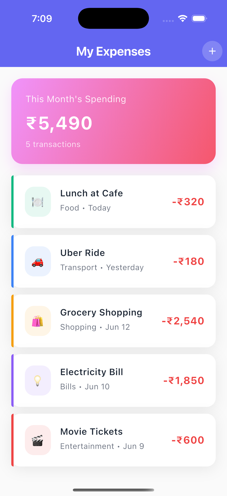
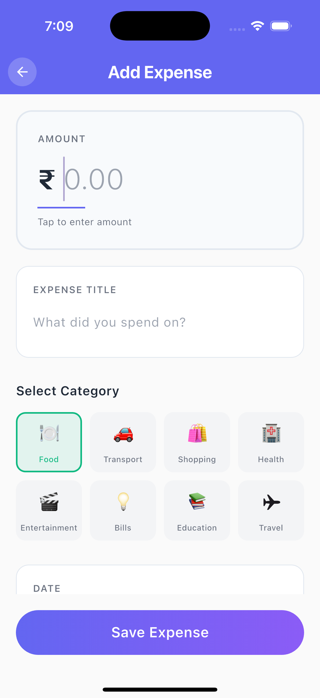

# ExpenseTracker
A beautiful Flutter app to track your expense and motivate you to avoid unnecessary expenses

## Screenshots

  
  

## Features

- ✨ Clean and modern UI design
- 📱 Responsive mobile interface
- 💰 Easy expense tracking
- 🏷️ Category-based organization
- 📅 Date selection
- 📊 Monthly spending summary

## Built With

- Flutter
- Dart
- Material Design 3